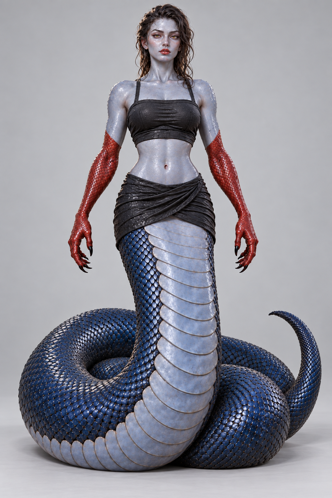
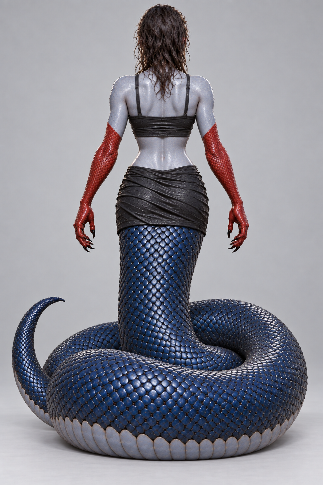
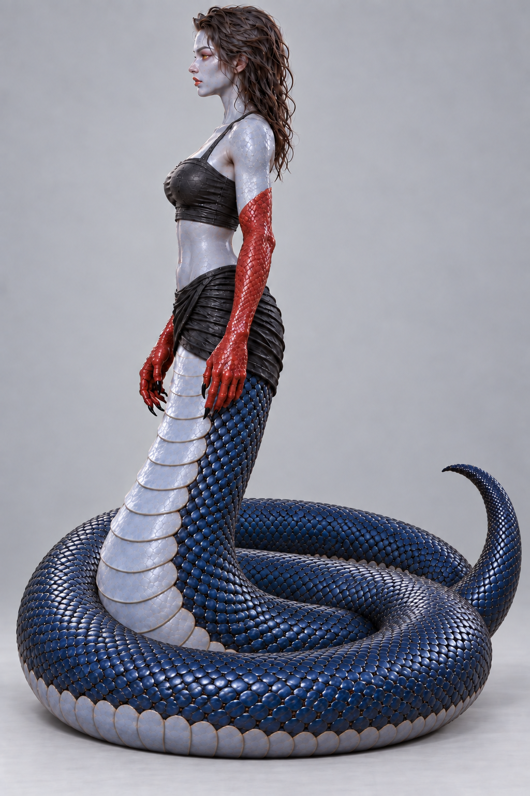
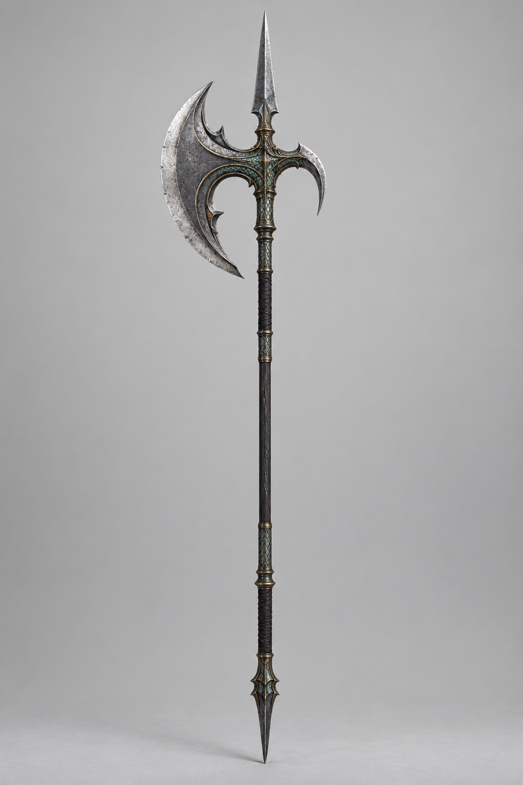
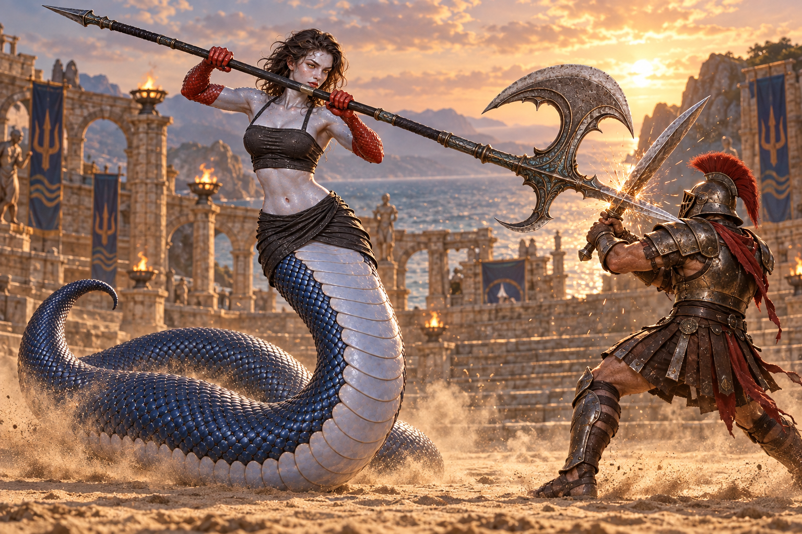

# Сайра — Солёная Чешуя

**Нага · 30 лет · боец арены · хранительница прибрежного клана**

[Открыть интерактивную карточку](https://SergeyYan.github.io/Naga/) · [Скачать полный набор](sayra-complete-pack-v3.zip) · [Скачать четыре ракурса](sayra-tripo-references-v3.zip)

## История

Сайра выросла среди затопленных храмов Лазурной лагуны. Когда хозяева арен захватили побережье, она вступила в турнир: победителю обещали свободу для его народа. Она ищет союзников среди соперников и сражается, чтобы вернуть дом.

## Характер

Спокойная, гордая и наблюдательная. Держит слово, уважает честный бой и не терпит бессмысленной жестокости. С близкими заботлива и обладает сухим чувством юмора.

**Качества:** терпение, самоконтроль, точность, стойкость, верность и тактическое мышление.

**Слабости:** долго помнит предательство, неохотно просит о помощи, медленнее восстанавливается в холоде.

## Ракурсы для 3D

Нажмите на изображение, чтобы открыть полный PNG и сохранить его.

| Спереди | Сзади |
| :---: | :---: |
|  |  |

| Профиль: лицо влево | Профиль: лицо вправо |
| :---: | :---: |
|  |  |

Ракурсы созданы по общему референсу. Длина и геометрия витков не подтверждены точным измерением; результат реконструкции необходимо проверить в Tripo3D.

## Алебарда «Приливный Клык»

Сайра любит алебарды за контроль дистанции. Хвост служит опорой для разворотов и широких ударов. Задуманная длина оружия — около **3,2 м**.

## Сайра в бою

### Выпад в щит

### Рубящий удар и блок

## Файлы

- [Полная история и описание](sayra-character.md)
- [Полный набор ZIP](sayra-complete-pack-v3.zip)
- [Четыре ракурса ZIP](sayra-tripo-references-v3.zip)
- [HTML-карточка](https://SergeyYan.github.io/Naga/)
- [Промпты генерации](sayra-generation-prompts.txt)
